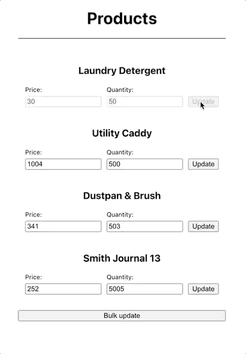

This project contains 2 subprojects: `client` & `server`.

# Client

## Setup

* Navigate to `client` directory: `cd client`
* Run `yarn` to install packages
* Run `yarn start` to run locally

## Improvements

- Use a better css framework (e.g: scss)
- Use form library (e.g: react-hook-form)
- Optimization: only pass the updated product to the API
- Create components for Button and Input fields

# Server

## Setup

* Navigate to `server` directory: `cd server`
* Run `yarn` to install packages
* Run `yarn start` to run locally

## Improvements:
- Add validation in update product endpoint
- Use Offline.yml (serverless-offline-aws-ssm) for different environments
- Add structured logging
- Handle 10-product limitation of bigCommerce in update product endpoint

# Sample
